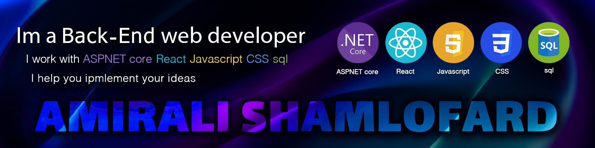

#

<h1 align="center">Hi 👋, I'm Amirali Shamlo</h1>

- 👯 I’m looking to collaborate on : **.NET Projects**

- 💬 Ask me about **C# , ASP.Net Core , React ** 

- ⚡ Fun fact **I Think I am funny**

- 📫 How to reach me: **amiralishamlofarde@gmail.com**

- 💻 Visit my site: **https://amiralishamlofard.ir**

<h3 align="center">Connect with me:</h3>

<h3 align="left">Languages and Tools:</h3>

 
 
 
 
 
 
 
 
 
 
 
 
 
 
 

 

